# OAuth2 Protocol and Grant Types

OAuth2 is an authorization framework that enables secure access to protected resources without exposing user credentials. It provides different **grant types**, each designed for specific use cases.

## Table of Contents

1. [Overview of OAuth2](#overview-of-oauth2)
2. [What is a Grant Type?](#what-is-a-grant-type)
3. [Grant Types](#grant-types)
    - [Authorization Code Grant](#authorization-code-grant)
    - [Implicit Grant](#implicit-grant)
    - [Resource Owner Password Credentials Grant](#resource-owner-password-credentials-grant)
    - [Client Credentials Grant](#client-credentials-grant)
    - [Refresh Token Grant](#refresh-token-grant)
    - [Device Authorization Grant](#device-authorization-grant)
4. [Conclusion](#conclusion)

---

## Overview of OAuth2

OAuth2 is designed to provide a secure way for applications to obtain access to user data without requiring the user to share their credentials. Instead, it uses **access tokens** issued by an **Authorization Server** to allow applications to request data from a **Resource Server**.

---

## What is a Grant Type?

A **grant type** in OAuth2 is a method by which a client application obtains an access token. It defines the flow that an application follows to request and receive authorization from an authorization server. Different grant types exist to accommodate various security needs and application types.

---

## Grant Types

### Authorization Code Grant

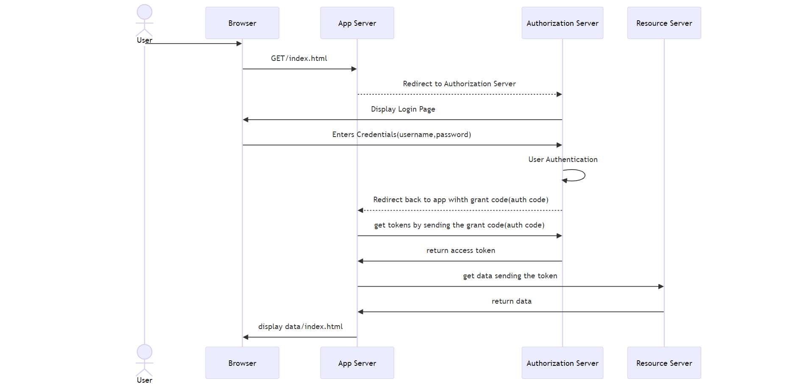

The **Authorization Code Grant** is used by web applications and follows a redirection-based flow to obtain an access token securely.

#### Steps:

1. The user accesses a web application and is redirected to an **Authorization Server** for authentication.
2. The user logs in, and if successful, the Authorization Server redirects back to the application with an **authorization code**.
3. The application exchanges this authorization code for an **access token**.
4. The access token is then used to request protected resources from the **Resource Server**.


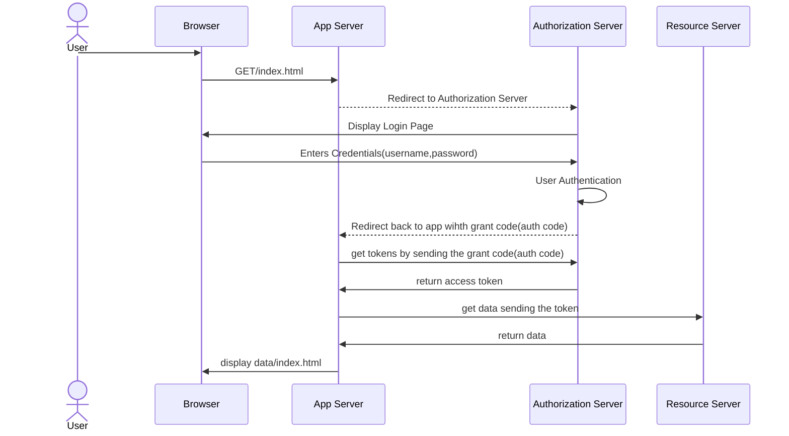

---

### Implicit Grant

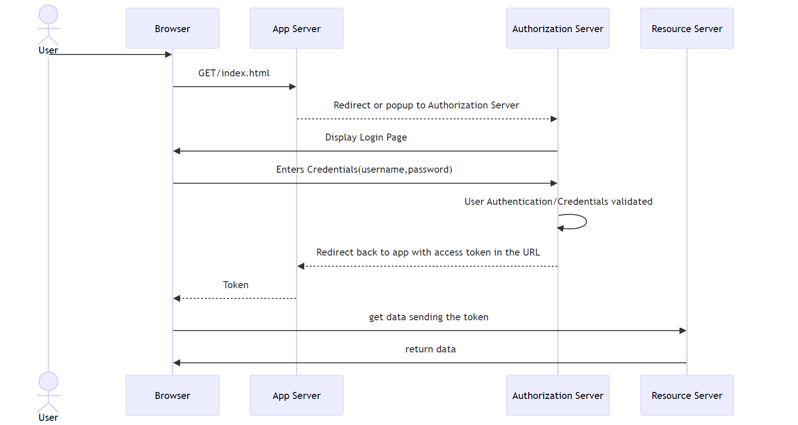

The **Implicit Grant** is used for single-page applications (SPAs) where storing client secrets securely is not possible. It directly provides an access token.

#### Steps

1. The user is redirected to the **Authorization Server**, logs in, and approves access.
2. Instead of returning an authorization code, the Authorization Server directly returns an **access token** in the URL.
3. The client application uses this token to access the **Resource Server**.

```mermaid
  actor User
  participant Browser
  participant App Server
  participant Authorization Server
  participant Resource Server

  User ->> Browser: 
  Browser ->> App Server: GET/index.html
  App Server -->> Authorization Server: Redirect or popup to Authorization Server
  Authorization Server ->> Browser: Display Login Page
  Browser ->> Authorization Server: Enters Credentials(username,password)
  Authorization Server ->> Authorization Server: User Authentication/Credentials validated
  Authorization Server -->> App Server: Redirect back to app with access token in the URL
  App Server-->>Browser:Token
  Browser ->> Resource Server: get data sending the token
  Resource Server->>Browser:return data
```

---

### Resource Owner Password Credentials Grant
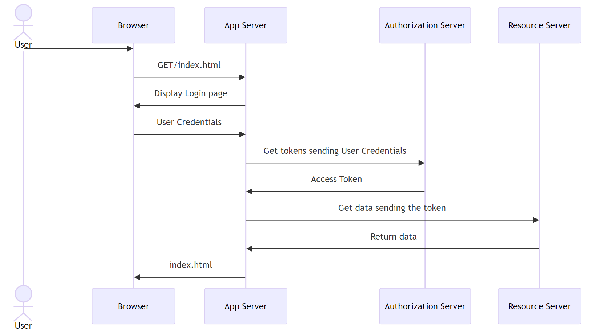

Used when the application is **trusted**, and the user directly provides their credentials to the client application.

#### Steps

1. The user enters their credentials directly into the application.
2. The application sends these credentials to the **Authorization Server**.
3. If valid, the Authorization Server responds with an **access token**.
4. The application uses the access token to request data from the **Resource Server**.

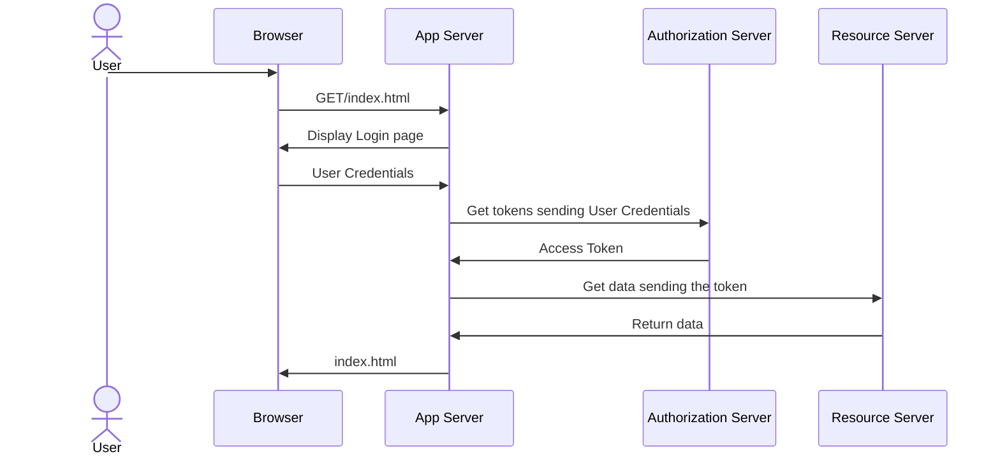

---

### Client Credentials Grant
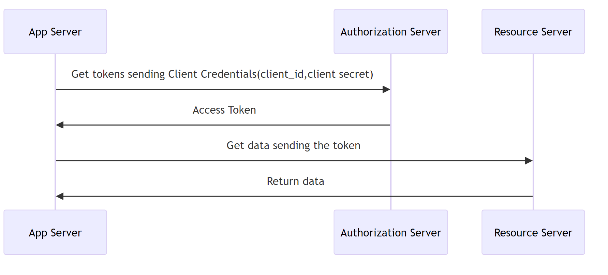

Used when a client application needs to access its own resources without user intervention.

#### Explanation

1. The application sends its **client ID and secret** to the **Authorization Server**.
2. If valid, the Authorization Server responds with an **access token**.
3. The application uses the token to access the **Resource Server**.

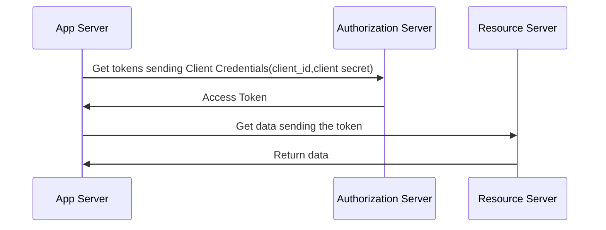

---

### Refresh Token Grant
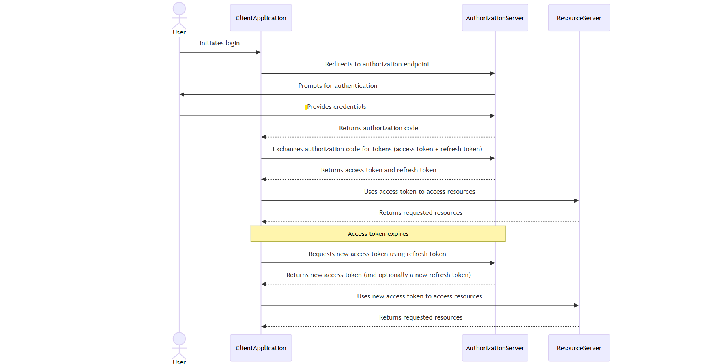

Allows clients to obtain a **new access token** using a refresh token without requiring user intervention.

#### Steps

1. The client application initially receives both an **access token** and a **refresh token** after a successful authentication process using a grant type(e.g. Authorization Code grant).
2. The client uses the **access token** to request protected resources.
3. When the **access token** expires,  the client sends the **refresh token** to the **Authorization Server**.
4. If the **refresh token** is valid, the Authorization Server returns a new **access token** (and optionally a new **refresh token**).
5. The client continues using the new access token to access resources.

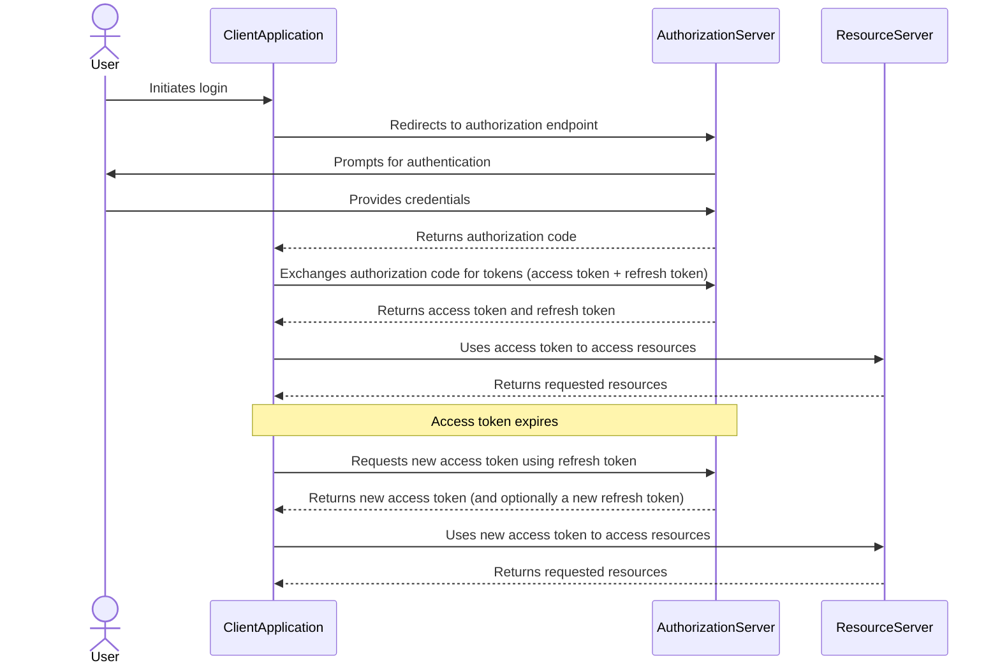

### Device Authorization Grant

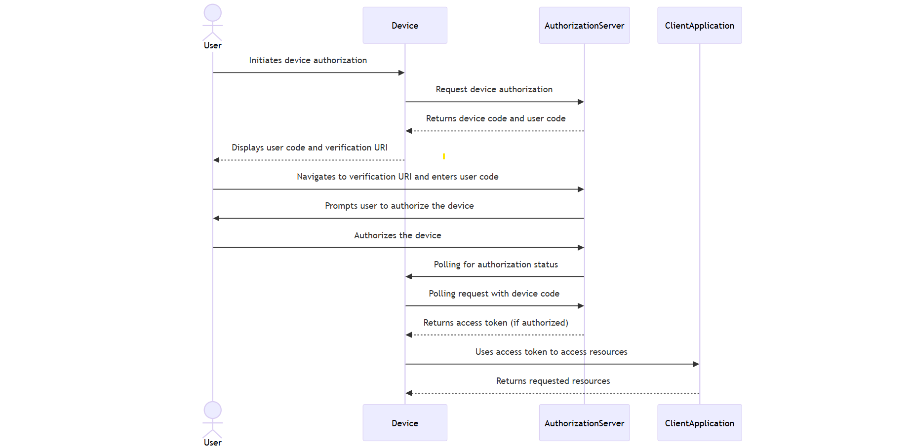

Used for devices with limited input capabilities, such as smart TVs and IoT devices.

#### Steps:
1. The user initiates the device authorization.
2. The device requests authorization from the **Authorization Server**.
3. The Authorization Server returns a **device code** and a **user code**.
4. The device displays the **user code** and **verification URI**.
5. The user navigates to the verification URI and enters the **user code**.
6. The Authorization Server prompts the user to authorize the device.
7. Once approved, the device polls the Authorization Server for the access token.
8. The Authorization Server issues an **access token**.

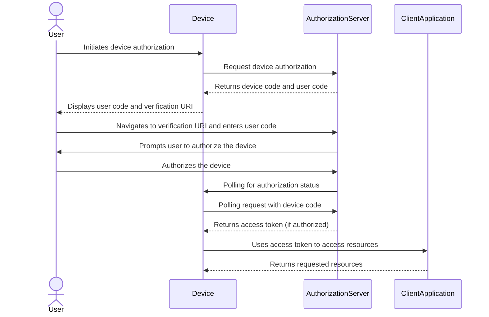

---

---

## Conclusion

OAuth2 provides **multiple grant types** to support different authentication scenarios. The correct grant type should be chosen based on:

- **Security requirements**
- **Client type (web, mobile, server-to-server, IoT devices, etc.)**
- **User experience needs**

Using the appropriate flow ensures **secure and efficient** authorization for your application.

---

